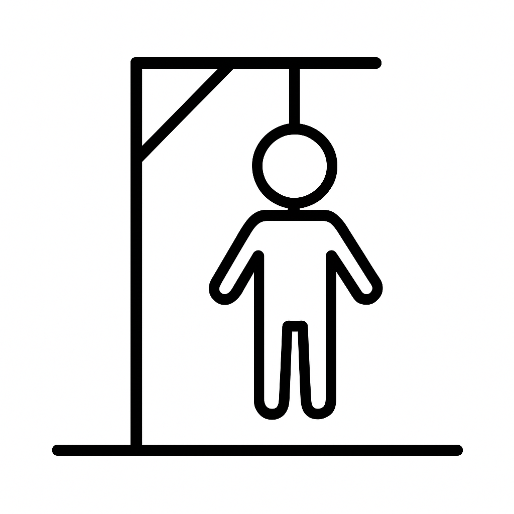

# Juego del Ahorcado en Java 

Este es un proyecto simple del clásico juego del ahorcado hecho con Java y Swing.

## 🎮 Características
- Palabra aleatoria en cada partida
- Interfaz gráfica con Swing
- Contador de errores
- Imágenes que simulan el dibujo del ahorcado

## ▶️ Cómo ejecutar
Abrir el proyecto en IntelliJ y ejecutar `Main.java`.

## 🖼 Imágenes del juego

## 📁 Estructura del proyecto
Ahorcado/

── src/
│ ├── Main.java
│ ├── AhorcadoFrame.java
│ └── AhorcadoLogica.java
├── img/
│ └── 0.png ... 6.png
└── README.md

https://juanmanuel1970.github.io
